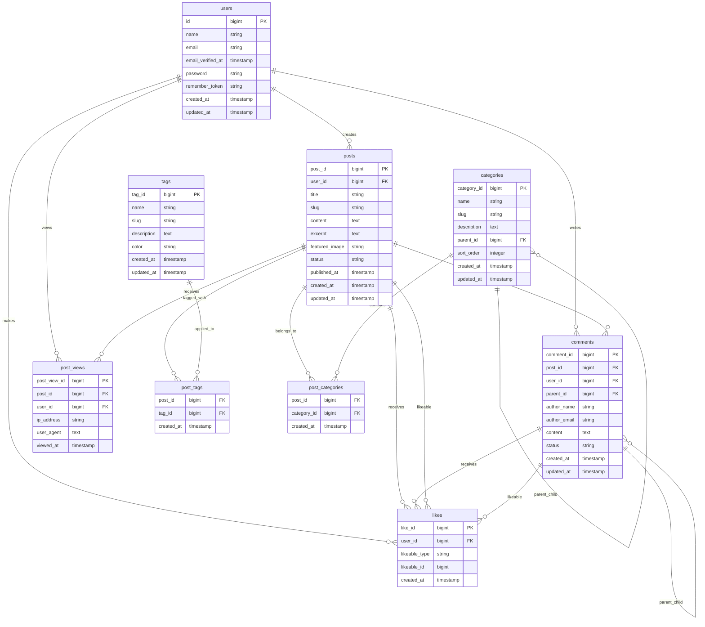

# Entity Relationship Diagram

## Database Schema Overview

This document describes the database schema for the Laravel blog application used in the web performance testing project.

## ER Diagram

## Entity Descriptions

### Primary Entities

#### Users
- Standard Laravel authentication table
- Stores user account information
- Has relationships to posts, comments, views, and likes

#### Posts
- Main content entity with custom primary key `post_id`
- Belongs to a user (author)
- Has rich content fields including title, slug, content, excerpt
- Supports featured images and publication status
- Related to categories, tags, comments, views, and likes

#### Categories
- Hierarchical category system with self-referencing parent-child relationships
- Custom primary key `category_id`
- Supports nested categories via `parent_id`
- Includes sorting order for display control

#### Tags
- Simple tagging system with custom primary key `tag_id`
- Includes color coding for UI display
- Many-to-many relationship with posts

#### Comments
- Nested comment system with self-referencing parent-child relationships
- Custom primary key `comment_id`
- Supports both authenticated users and guest comments (author_name/author_email)
- Polymorphic relationship with likes

#### Post Views
- Tracking table for post views with performance monitoring
- Custom primary key `post_view_id`
- Captures IP address and user agent for analytics
- Optional user association for authenticated views

#### Likes
- Polymorphic like system supporting multiple entity types
- Custom primary key `like_id`
- Can be applied to both posts and comments via `likeable_type` and `likeable_id`

### Junction Tables

#### Post Tags
- Many-to-many relationship between posts and tags
- Includes timestamp for tracking when tags were applied

#### Post Categories
- Many-to-many relationship between posts and categories
- Includes timestamp for tracking when categories were assigned

## Key Relationships

### One-to-Many Relationships
- `users` → `posts` (User creates multiple posts)
- `users` → `comments` (User writes multiple comments)
- `users` → `post_views` (User views multiple posts)
- `users` → `likes` (User likes multiple items)
- `posts` → `comments` (Post has multiple comments)
- `posts` → `post_views` (Post receives multiple views)

### Many-to-Many Relationships
- `posts` ↔ `tags` (via `post_tags` table)
- `posts` ↔ `categories` (via `post_categories` table)

### Self-Referencing Relationships
- `categories` → `categories` (Parent-child hierarchy)
- `comments` → `comments` (Nested replies)

### Polymorphic Relationships
- `likes` → `posts` or `comments` (Polymorphic likeable system)

## Performance Testing Considerations

This schema is designed for performance testing with:
- Custom primary keys for consistent performance characteristics
- Comprehensive eager loading relationships to prevent N+1 queries
- Batch operations for efficient bulk insertions
- Polymorphic relationships for flexible like system
- Hierarchical structures for complex query testing

## Data Seeding

The schema supports reproducible performance testing with:
- 100 users with fixed seed
- 1,000 posts (10 per user)
- 5,000 comments (5 per post)
- 5,000 post views with tracking data
- 5,000 likes with polymorphic relationships
- 30 categories (hierarchical structure)
- 100 tags with color coding
- Many-to-many relationships with 5 tags and 5 categories per post