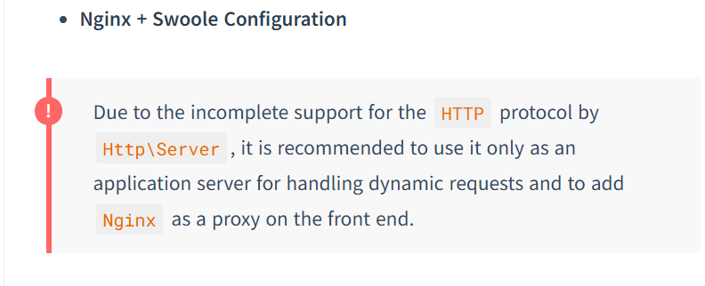
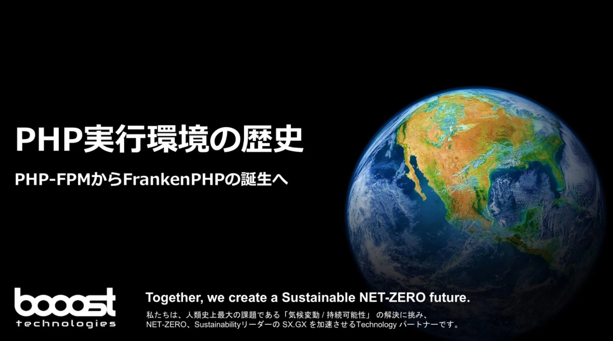
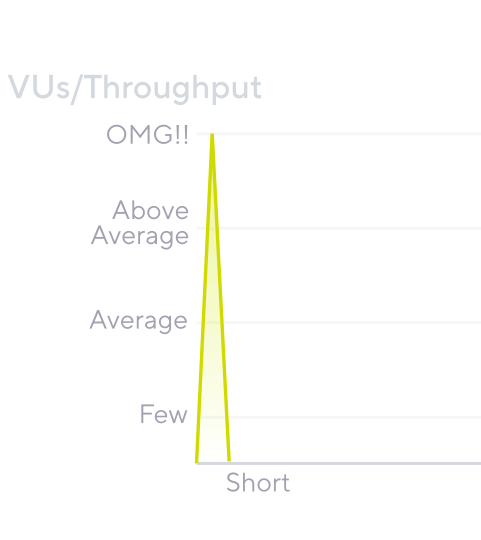
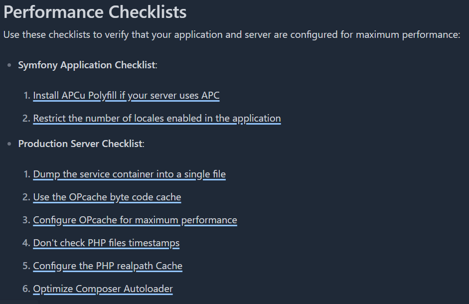
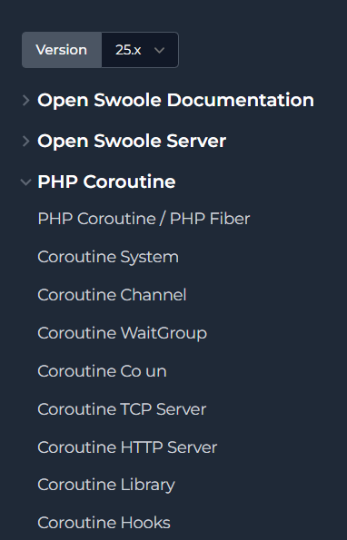

<!-- paginate: true -->

## PHPビルドバージョンと実行環境の比較

---

## 概要

PHPには2つのビルドバージョンがあります
それぞれ異なる実行環境に最適化されています

1. NTS（Non Thread Safe）
1. ZTS（Zend Thread Safe）

---

## NTS（Non Thread Safe）

シングルスレッド環境向けに最適化されたビルド
スレッド間の排他制御が不要

## ZTS（Zend Thread Safe）

マルチスレッド環境で安全に動作する
メモリやリソースへのアクセスを同期化する仕組みを持つ

---

|  | NTS (Non Thread Safe) | ZTS (Zend Thread Safe) |
| --- | --- | --- |
| 対象環境 | シングルスレッド<br>（プロセスベース） | マルチスレッド環境 |
| メモリ使用量 | プロセスごとに全体を複製<br>（非効率） | スレッド間でコード共有<br>（効率的） |
| 適用環境 | <p></p><p></p> | <p></p><p></p>|

---

## 各実行環境の概要紹介

---

# Apache + mod_php 

- NTS（Non Thread Safe）、プロセスベース
- ApacheのモジュールとしてPHPが直接組み込まれる形式
- リクエストごとにプロセスが処理されるため、メモリ使用量が大きくなりがち
- 設定がシンプルで歴史も長い。レガシーシステムで採用されている定番構成


---

# Nginx + PHP-FPM

- NTS（Non Thread Safe）、マルチプロセス形式
- NginxとPHP-FPM（FastCGI Process Manager）が別プロセスで動作する
- プロセスプールによるリソース管理で、高トラフィック時の安定性とメモリ効率が優秀


---

# Nginx + Swoole

- NTS版とZTS版の両方が存在（コルーチンはシングルスレッドで動作）
- PHPの非同期I/O拡張で、コルーチンベースの並行処理を実現
- HTTPサーバー機能を内蔵し、常駐プロセスでリクエストを処理するため高速


---

# Swooleの補足事項

Swoole自体組み込みWebサーバーを持っています
が、餅は餅屋。Webサーバーを立てることを公式も推奨。



---

# FrankenPHP

- ZTS（Zend Thread Safe）、マルチスレッド形式
- Go言語で実装されたPHPのSAPIで、Caddyサーバーに統合されている
- ワーカーモードによるアプリケーション常駐化で、起動オーバーヘッドを削減


---

# FrankenPHPの補足事項

2025年5月に**PHP Foundation**からのオフィシャルサポートを受けることが決定。
積極的にサポートされることが公式に発表されました。

[FrankenPHP Is Now Officially Supported by The PHP Foundation — The PHP Foundation — Supporting, Advancing, and Developing the PHP Language](https://thephp.foundation/blog/2025/05/15/frankenphp/)

---

各実行環境の詳細はこちらのスライドで説明しています（宣伝）
https://www.docswell.com/s/1313108/ZP2QQ1-2025-03-21-123847



---

負荷試験環境の話をここから書いていく

---

## ざっくり実行環境紹介

前提となる各PHP実行環境を紹介します

---

# 詳細はこちら

githubに挙げているので、そちらを参照してください

---

# 各環境共通事項

### アプリケーション基盤

<div class="tech-stack">
  <div class="tech-item">
    
    <div class="tech-info">
      <div class="tech-name">PHP</div>
      <div class="tech-version">8.3.20</div>
    </div>
  </div>
  <div class="tech-item">
    
    <div class="tech-info">
      <div class="tech-name">MySQL</div>
      <div class="tech-version">8.0</div>
    </div>
  </div>
  <div class="tech-item">
    
    <div class="tech-info">
      <div class="tech-name">Laravel</div>
      <div class="tech-version">12.0</div>
    </div>
  </div>
  <div class="tech-item">
    
    <div class="tech-info">
      <div class="tech-name">Docker</div>
    </div>
  </div>

</div>

---

## 異なる構成部分

<div class="columns">
<div>

### NTS（スレッド安全でない）構成
- Laravel 12
#### 対象実行環境
- Apache + mod_php 
- Nginx + php-fpm 

</div>
<div>

### ZTS（スレッド安全）構成
- Laravel 12 + **Octane**
#### 対象実行環境
- Swoole + Nginx (Laravel Octane)
- FrankenPHP (Laravel Octane)

</div>
</div>

---

# 比較検証のポイント

1. **レスポンス時間**: 同一負荷での応答速度比較
2. **スループット**: 単位時間あたりの処理能力
3. **メモリ使用量**: 各構成でのメモリ効率
4. **CPU使用率**: 処理負荷によるCPU消費
5. **同時接続数**: 最大同時接続処理能力
6. **エラー率**: 高負荷時のエラー発生率

---

# 計測ツール

<div class="tech-stack">
  <div class="tech-item">
    
    <div class="tech-info">
      <div class="tech-name">k6</div>
      <div class="tech-version">負荷検証</div>
    </div>
  </div>

  <div class="tech-item">
    
    <div class="tech-info">
      <div class="tech-name">OpenTelemetry</div>
      <div class="tech-version">プロファイリング</div>
    </div>
  </div>
</div>


### OpenTelemetryを選んだ理由
- ZTS環境に対応したプロファイリングツールが少ない
- 詳細: https://zenn.dev/booost/articles/a691d0fe7aeae6

---

# 計測しない項目

**ブラウザレンダリング**
- WebAPIサーバーとして振る舞うことが多いため

---

# テストシナリオ

**記事投稿 + 記事取得**
- 実際のWebアプリケーションを想定
- CRUD操作の性能を検証

---


## データベース
計：９テーブルを更新する

<div class="columns">
<div>

1. usersd
2. posts
3. categories
4. tags
5. comments

</div>
<div>

6. post_views
7. likes
8. post_tags
9. post_categories

</div>
</div>

---


## PHP実行環境パフォーマンス比較

4つの実行環境でパフォーマンス測定を実施

---

## 負荷試験シナリオ１

### 目的
多数のユーザーによる同時アクセス時の**レスポンス性能**と**安定性**を評価する

### 概要
ユーザーが記事を投稿して、
投稿した記事を他のユーザーが閲覧しに来る想定


---

### 試験概要

- **ユーザー行動**: 記事投稿 **1回**につき、記事閲覧が**10回**発生する
- **負荷増加**: 開始**60秒**で最大**80ユーザー/秒**まで増加させる
- **維持時間**: 最大負荷で**3分間**維持する

### 合格基準 (SLO)

- **記事投稿** (P90): **3秒**以内
- **記事閲覧** (P90): **1秒**以内
- **エラーレート**: **0.1%** 未満

---

## 計測結果発表

---

どの環境もエラーは無し！
素晴らしい！
👏

---

## リソース使用量比較

CPU使用率とメモリ使用量の比較

| 環境 | 平均CPU使用率 | 平均メモリ使用量 | CPU効率 | メモリ効率 |
| --- | --- | --- | --- | --- |
| Apache+PHP | 35.77% | 360.08MiB | 要改善 | 普通 |
| Nginx+PHP | 34.32% | **88.75MiB** | 普通 | **最優秀** |
| **Swoole** | **32.03%** | 962.9MiB | **良好** | 要注意 |
| **FrankenPHP** | **20.47%** | 288.4MiB | **最優秀** | 良好 |

---

## PHP実行環境比較結果

| 環境 | P95レスポンス | P90レスポンス | スループット |
| --- | --- | --- | --- |
| Apache+PHP | 36.91ms | 27.99ms | 28.49 RPS |
| Nginx+PHP | 33.77ms | 25.54ms | 28.06 RPS |
| Swoole | 27.15ms | 20.51ms | 28.58 RPS |
| **FrankenPHP** | **25.82ms** | **19.51ms** | **28.65 RPS** |

<!-- FrankenPHPが最高のレスポンス性能、Nginx+PHPが最少メモリ使用量 -->

---

## レスポンス時間詳細比較

各処理別のレスポンス時間（P90）

| 環境 | POST処理<br>（記事作成） | GET処理<br>（記事取得） |
| --- | --- | --- |
| Apache+PHP | 49.61ms | 22.45ms |
| Nginx+PHP | 50.53ms | 20.69ms |
| **Swoole** | **45.64ms** | **16.38ms** |
| **FrankenPHP** | **45.86ms** | **15.48ms** |

<!-- FrankenPHP、Swooleが高速。従来環境より30-40%高速 -->

---

## 計測結果総評

### リソース効率
- 全環境でエラー発生なし（**100%安定性**）
- **CPU効率**: FrankenPHP > Swoole > 従来構成
- **メモリ効率**: Nginx+PHP > FrankenPHP > Apache > Swoole

**補足**
- Nginxはサーバーとphp-fpmでメモリが分散
- Swooleはメモリにプロセスを常駐させるため、他と比べて消費率高

---

### パフォーマンス面
- **FrankenPHP**が総合的に最優秀（レスポンス・CPU効率）
- **Swoole**もFrankenPHPに匹敵する高性能
- 従来構成比で**30-40%の性能向上**を実現

とはいえ…

| 環境 | P95レスポンス | P90レスポンス | スループット |
| --- | --- | --- | --- |
| Apache+PHP | 36.91ms | 27.99ms | 28.49 RPS |
| **FrankenPHP** | **25.82ms** | **19.51ms** | **28.65 RPS** |

ここまで見て意外と大きな差がないように見えたのではないでしょうか

---

ここで影の立役者
### OPcache


---

## OPcacheの有無で比較

Apache+mod_php
同じ環境でもこれだけの違いが出ます

| 項目 | Memcache無し | Memcache有り | 改善率 |
| --- | --- | --- | --- |
| **平均使用CPU** | 290% | 48% | **83%削減** |
| **平均使用メモリ** | 2.175 **GiB** | 462.1 **MiB** | **79%削減** |
| **平均レスポンス** | 90.31ms | 18.46ms | **80%改善** |
| **P90レスポンス** | 119.35ms | 27.99ms | **77%改善** |
| **P95レスポンス** | 130.59ms | 36.91ms | **72%改善** |

---

opcacheありのApache+mod_php
opcacheなしのfrankenphp
そんなに変わらない

---

## opcacheの導入により大幅な性能改善

こんな簡単な設定でも効果<span class="font-size-large">大</span>
```
- opcache.enable=1  // 有効にする
- opcache.enable_cli=1 // cliモードでも有効にする
- opcache.memory_consumption=128 // キャッシュサイズの指定
```
WebサーバーやDBのチューニングも重要だけれど
PHPのチューニングも大切！

---

PHPのチューニングの話は一旦おしまい。
よりWebサーバーの性能差が出る検証を見ていきます

---

## 負荷シナリオ２

### 目的

セール予告後のような急激なトラフィック増加に対する
Webアプリケーションの**レスポンス性能**と**安定性**を評価する。

**試験内容**:
* **開始**: 0ユーザーから10秒で10ユーザーに増加
* **スパイク**: 20秒で200ユーザーまで急激に増加
* **終了**: 10秒で0ユーザーに減少



---

**合格基準 (SLO)**:
* **レスポンスタイム (95パーセンタイル値)**: **2秒**未満
* **エラーレート**: **1%** 未満

---

<h1 class="slide-section">計測結果発表</h1>

---

## スパイクテスト結果比較

PHPアプリケーションサーバー性能比較
200VU・40秒間のスパイクテスト

---

## テスト概要

| 項目 | 値 |
| --- | --- |
| 最大VU数 | 200 |
| テスト時間 | 40秒 |
| 段階 | 3段階のスパイク |
| 閾値 | P95 < 2秒、失敗率 < 1% |

---


## テスト概要

- **テストタイプ**: スパイクテスト
- **最大VU数**: 200
- **テスト時間**: 40秒 (3段階)
- **閾値**: p(95) < 2秒, エラー率 < 1%

---

## レスポンス時間比較

| サーバー | p(90) | p(95) | スループット | エラー率 | 結果 |
|---------|-------|-------|-------------|---------|------|
| Apache | 68.92ms | 1.68s | 35.9 req/s | <span class="attention">2.19%</span> | ⚠️ |
| Nginx+FPM | 22.15ms | 24.72ms | 38.1 req/s | 0.00% | ✅ |
| Swoole | 18.38ms | 21.33ms | 38.1 req/s | 0.00% | ✅ |
| FrankenPHP | 18.9ms | 21.44ms | 39.5 req/s | 0.00% | ✅ |


---

## リソース使用量

| サーバー | 平均CPU使用率 | 平均メモリ使用率 | 効率 |
|---------|---------|-----------|------|
| Apache | 66.86% | 648.09MB | 低 |
| Nginx+FPM | 45.81% | 65.59MB | 高 |
| Swoole | 36.87% | 980.35MB | 中 |
| FrankenPHP | 37.16% | 288.75MB | 高 |

---

# 結果サマリー

**性能ランキング:**
1. **Swoole** - 最速レスポンス
2. **FrankenPHP** - 最高スループット
3. **Nginx+FPM** - バランス良好
4. **Apache** - 高負荷時に劣化

**リソース効率:**
- FrankenPHP・Nginx: 低メモリ
- Swoole: 低CPU使用率

---

## 負荷シナリオ1・2総評

### パフォーマンス面の発見

**通常負荷時（シナリオ1）**
- 全環境で安定動作、差は僅差
- FrankenPHPが総合的に最優秀
- OPcacheの効果が絶大（80%の性能向上）

**高負荷時（シナリオ2）**
- 環境間の性能差が顕著に現れる
- 従来のApache構成では限界が露呈
- ZTS・NTS環境が高負荷耐性で優位性を発揮

---

### 実運用での選択指針

**性能重視**: FrankenPHP・Swoole
**リソース効率**: Nginx+PHP-FPM
**安定性重視**: Nginx+PHP-FPM・FrankenPHP

### 重要な教訓
**OPcacheは必須設定**
どの環境でも80%の性能向上効果

---

FrankenPHPに乗り換えるのが正解か？


---

<h1 class="slide-section"> 既存環境のパフォーマンスを<br>向上させる

---

<ul class="ol-large">
<li>1. opcacheを使う</li>
<li>2. Apache, Nginx のearly hints(103)対応</li>
<li>3. Symfonyのドキュメントを参照する</li>
<li>4. 潜在能力を秘めたSwoole</li>
</ul>

---

# 1. opcacheを使う

### 再掲
```
- opcache.enable=1  // 有効にする
- opcache.enable_cli=1 // cliモードでも有効にする
- opcache.memory_consumption=128 // キャッシュサイズの指定
```

---


# 2. Apache, Nginxのearly hints(103)対応
<p>&nbsp;</p>
<div class="columns">
  <p class="one"></p>
  <p class="three">ver：1.29.0<br>2025年6月24日リリース</p>
</div>

<div class="columns">
  <p class="one"></p>
  <p class="three">モジュール：HTTP/2<br>https://httpd.apache.org/docs/current/howto/http2.html<br>#page-header</p>
</div>

このプレゼン中には間に合いませんでした...

---

### FrankenPHPの対応状況

<p>&nbsp;</p>
<div class="columns">
  <p class="one"></p>
  <p class="three">early hints(103)は組み込み済み<br>
  PHPのコードに headers_send(103); と書くだけでOK<br>とても楽
  </p>
</div>

---

# 3. Symfonyのドキュメントを参照する
<p>&nbsp;</p>
<p>&nbsp;</p>
<div class="columns">
  <p class="three"></p>
  <p class="one">に関わらず役立つ情報がたくさん</p>
</div>
<a href="https://symfony.com/doc/current/performance.html">https://symfony.com/doc/current/performance.html</a> 

---

# 4. 潜在能力を秘めたSwoole
<p>&nbsp;</p>
<p>&nbsp;</p>
<div class="columns">
  <p class="one"></p>
  <p class="one">
細かなチューニング項目が満載<br>
ざっくり80項目以上<br>
まだまだ早くなる</p>
</div>


---

## まとめ：PHP実行環境選択の指針

---

# アプリケーションの状態で考える

## そもそも現状に課題がないないのなら<br>変える必要はない

今Apache + mod_php環境であっても
課題がないのなら変える必要はありません。
Apacheもバリバリ更新中

---

# アプリケーションの利用用途で考える

## 読み取り主体か、書き込み主体か

### アプリケーションが読み取り主体
Webサーバー・PHPのチューニングが効果的

### アプリケーションが書き込み主体
DBのチューニングが効果的

---

# 実行環境特性まとめ


## Apache+PHP


- **適用シーン**: 既存継続運用。情報が豊富
- **主なメリット**: 設定が簡単で、安定性している
- **注意点**: １台で高負荷を受けると性能が劣化する
LBを設置して複数サーバーに分散すれば、問題点も解消しやすい

---

## Nginx+PHP-FPM


- **適用シーン**: バランス重視。現在最も普及している構成。
- **主なメリット**: 低メモリで安定性が高い。
- **注意点**: 中程度の性能だが、実用上は十分。
１台１台のリソース効率が最も良好だが、サーバー台数が増えがち

---

## Swoole


- **適用シーン**: 高性能要求。リアルタイム性が重要なシステム
- **主なメリット**: 最速レスポンス。コルーチンによる非同期処理
- **注意点**: メモリ消費大・チューニング項目が多岐にわたる<br>（80項目以上）
常駐プロセスのため、メモリリークに注意が必要

---

## FrankenPHP


- **適用シーン**: 簡単に高性能要求を実現したい。
- **主なメリット**: 簡単にいい性能を取りやすい（Early Hints標準対応など）
- **注意点**: 新しい技術のため情報が少ない
実運用例も少ない

---

皆さんの実行環境選択の助けになれば幸いです
ご清聴ありがとうございました
