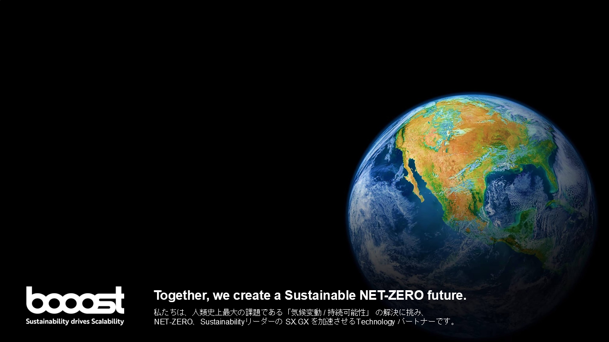
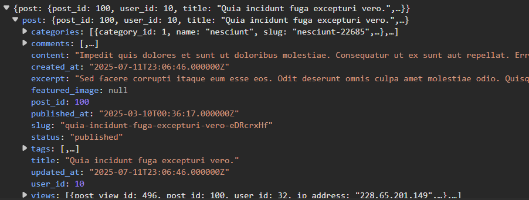

<h1 class="slide-title">
どこまで違う？！<br>PHP実行環境パフォーマンス対決<br>
<span class="subtitle">- mod_php vs php-fpm vs Swoole vs FrankenPHP
</h1>

---


<!-- paginate: true -->

## 目次

1. 導入
1. プロフィール・所属会社紹介
1. 各環境・用語・計測ツール紹介
1. 負荷シナリオ１ - アベレージロードテスト
1. 負荷シナリオ２ - スパイクテスト
1. 総評と選択指針
1. 環境を向上させるTips３選
1. まとめ

---

<h1 class="slide-section"> 導　入

---


# 比較・検証する環境

<div>
<p>今回は４つのPHP実行環境のパフォーマンス検証</p>
</div>

<div class="tech-stack">
  <div class="tech-item">
    
    <div class="tech-info">
      <div class="tech-name">Apache + mod_php</div>
      <div class="tech-version"></div>
    </div>
  </div>
  <div class="tech-item">
    
    <div class="tech-info">
      <div class="tech-name">Nginx + PHP-FPM</div>
      <div class="tech-version"></div>
    </div>
  </div>
  <div class="tech-item">
    
    <div class="tech-info">
      <div class="tech-name">Swoole + Nginx</div>
      <div class="tech-version"></div>
    </div>
  </div>
  <div class="tech-item">
    
    <div class="tech-info">
      <div class="tech-name">FrankenPHP</div>
      <div class="tech-version"></div>
    </div>
  </div>
</div>

---

# 実行シナリオ概要


**テストタイプ**：ストレステスト
**シナリオ概要**：ユーザーが記事を投稿して、
投稿した記事を複数のユーザーが閲覧しに来る

**テストタイプ**：スパイクテスト
**シナリオ概要**：セール予告後のような急激な閲覧者増によるトラフィック増加に対する

---

<p class="middle-text">ソースコード詳細はGitHubで公開中</p>
<div class="inline-img-block">
<p></p>
<a class="normal-text" href="https://github.com/gmagmeg/performance-comparison/tree/main">https://github.com/gmagmeg/performance-comparison/tree/main</a>
</div>


---

<p class="middle-text">それぞれの環境でどうなるか<br>想定しながらお愉しみください</p>

---

<ol class="table-content">
<li>導入</li>
<li class="active-text">プロフィール・所属会社紹介</li>
<li>各環境・用語・計測ツール紹介</li>
<li>負荷シナリオ１ - アベレージロードテスト</li>
<li>負荷シナリオ２ - スパイクテスト</li>
<li>総評と選択指針</li>
<li>環境を向上させるTips３選</li>
<li>まとめ</li>
</ol>


---

## プロフィール・所属会社紹介

<div class="columns">
  <div class="inline-img-block">
    
  </div>
  <div class="no-border">
    <dl>
      <dt>発表者</dt><dd>ma@me（SNS：ma_me）</dd>
      <dt>所属</dt><dd class=""></dd>
      <dt>直近の登壇</dt><dd>
      - phperkaigi 2025<br>
      （PHP実行環境の歴史 PHP-FPMからFrankenPHPの誕生へ）</dd>
    </dl>
  </div>
</div>

---

<ol class="table-content">
<li>導入</li>
<li>プロフィール・所属会社紹介</li>
<li class="active-text">各環境・用語・計測ツール紹介</li>
<li>負荷シナリオ１ - アベレージロードテスト</li>
<li>負荷シナリオ２ - スパイクテスト</li>
<li>総評と選択指針</li>
<li>環境を向上させるTips３選</li>
<li>まとめ</li>
</ol>

---

# 各環境紹介

## Apache + mod_php 

- NTS（Non Thread Safe） プロセスベース
- ApacheのモジュールとしてPHPが直接組み込まれる形式
- リクエストごとにプロセスが処理されるため、<br>リクエスト数に伴ってメモリ使用量が大きくなりがち
- 設定がシンプルで歴史も長い。<br>レガシーシステムで採用されている定番構成


---

## Nginx + PHP-FPM

- NTS（Non Thread Safe）、マルチプロセス形式
- NginxとPHP-FPM（FastCGI Process Manager）が別プロセスで動作する
- プロセスプールによるリソース管理で、<br>高トラフィック時の安定性とメモリ効率が優秀


---

## Nginx + Swoole

- NTS版とZTS版の両方が存在（コルーチンはシングルスレッドで動作）
- PHPの非同期I/O拡張で、コルーチンベースの並行処理を実現
- 常駐プロセスでリクエストを処理するため高速


---

## Swooleの補足事項

Swoole自体組み込みWebサーバーを持っています
が、餅は餅屋。Webサーバーを立てることを公式も推奨。


---

## FrankenPHP

- ZTS（Zend Thread Safe）、マルチスレッド形式
- Go言語で実装されたPHPのSAPIで、Caddyサーバーに統合されている
- ワーカーモードによるアプリケーション常駐化で<br>起動オーバーヘッドを削減


---

## FrankenPHPの補足事項

2025年5月　PHP Foundationからのオフィシャルサポートを受けることが決定


[FrankenPHP Is Now Officially Supported by The PHP Foundation — The PHP Foundation — Supporting, Advancing, and Developing the PHP Language](https://thephp.foundation/blog/2025/05/15/frankenphp/)

---

## より詳細な実行環境

より詳しい詳細はこちらのスライドで説明しています（宣伝）
https://www.docswell.com/s/1313108/ZP2QQ1-2025-03-21-123847


---

# 用語紹介

1. NTS（Non Thread Safe）
1. ZTS（Zend Thread Safe）

PHPには2つのビルドバージョンがあります
それぞれ異なる実行環境に最適化されています

---

## 🧵ZTS（Zend Thread Safe）

<div class="columns">
  <div class="no-border">
    マルチスレッド環境で異なるスレッドが<br>同一リソース（同一メモリや同一変数）にアクセスしても問題ないように、排他機構を持つ<br>
    排他機構のオーバーヘッドで、そのまま扱うとNTSより処理速度が低下する
  </div>
  <div class="inline-img-block">
    
    
  </div>
</div>

---

## 🔗NTS（Non Thread Safe）

<div class="columns">
  <div class="no-border">
    現在のほとんどの本番環境で採用されている<br>
    シングルスレッド環境向けに最適化されたビルド<br>
    排他機構を持たなくていい分、オーバーヘッドなし
  </div>
  <div class="inline-img-block">
    
    
  </div>
</div>


---

# 計測環境・計測ツール紹介

### 各環境共通アプリケーション基盤

<div class="tech-stack">
  <div class="tech-item">
    
    <div class="tech-info">
      <div class="tech-name">PHP</div>
      <div class="tech-version">8.3.20</div>
    </div>
  </div>
  <div class="tech-item">
    
    <div class="tech-info">
      <div class="tech-name">MySQL</div>
      <div class="tech-version">8.0</div>
    </div>
  </div>
  <div class="tech-item">
    
    <div class="tech-info">
      <div class="tech-name">Laravel</div>
      <div class="tech-version">12.0</div>
    </div>
  </div>
  <div class="tech-item">
    
    <div class="tech-info">
      <div class="tech-name">Docker</div>
    </div>
  </div>

</div>

---

## 異なる構成部分

<div class="columns">
<div>

### 🧵ZTS構成
- Laravel 12 + **Octane<br>（ZTS向けに最適化するライブラリ）**
#### 対象実行環境
- Swoole + Nginx (Laravel Octane)
- FrankenPHP (Laravel Octane)

</div>

<div>

### 🔗NTS構成
- Laravel 12<br>&nbsp;
#### 対象実行環境
- Apache + mod_php 
- Nginx + php-fpm 

</div>

</div>

---

## 計測ツール

<div class="tech-stack">
  <div class="tech-item">
    
    <div class="tech-info">
      <div class="tech-name">k6</div>
      <div class="tech-version">負荷検証</div>
    </div>
  </div>

  <div class="tech-item">
    
    <div class="tech-info">
      <div class="tech-name">OpenTelemetry</div>
      <div class="tech-version">プロファイリング</div>
    </div>
  </div>
</div>

### OpenTelemetryを選んだ理由
- そもそもZTS環境に対応したプロファイリングツールが少ない
詳細: https://zenn.dev/booost/articles/a691d0fe7aeae6

---

### 詳細はこちら

詳細なコードと設定はGitHubリポジトリで公開しています。
https://github.com/gmagmeg/performance-comparison

---

<ol class="table-content">
<li>導入</li>
<li>プロフィール・所属会社紹介</li>
<li>各環境・用語・計測ツール紹介</li>
<li class="active-text">負荷シナリオ１ - アベレージロードテスト</li>
<li>負荷シナリオ２ - スパイクテスト</li>
<li>総評と選択指針</li>
<li>環境を向上させるTips３選</li>
<li>まとめ</li>
</ol>

---

## 負荷試験シナリオ１ - アベレージロードテスト

<div class="columns ">
  <p class=""></p>
  <div class="three">
    <p><span class="bold-text">ℹ️概要</span><br>ユーザーが記事を投稿する<br>投稿した記事を複数のユーザーが閲覧しに来る</p>
    <p><span class="bold-text">🎯目的</span>　多数のユーザーによる同時アクセス時の レスポンス性能 と 安定性 を評価する</p>
  </div>
</div>

---

<h3 class="test-icon">🧪試験概要</h3>

- **ユーザー行動**: 記事投稿 **1回**につき、記事閲覧が**10回**発生する
- **負荷増加**: 開始**60秒**で最大**80ユーザー/秒**まで増加させる
- **維持時間**: 最大負荷で**3分間**維持する<br>4分間でおおよそ**6500回**のリクエストが発生

<h3 class="check-icon"> 合格基準 (SLO)</h3>

- **記事投稿** (P90): **3秒**以内
- **記事閲覧** (P90): **1秒**以内
- **エラーレート**: **0.1%** 未満

---

## アプリ概要

 から
`api/read-weight` にPOST・GETリクエスト

**計：９テーブルに書き込み＆読み取る**

---

## 対象テーブル

<div class="columns">
<div>

1. users
2. posts
3. categories
4. tags
5. comments

</div>
<div>

6. post_views
7. likes
8. post_tags
9. post_categories

</div>
</div>

---
## 該当のソースURL

- https://github.com/gmagmeg/performance-comparison/blob/main/new-apache/app/Http/Controllers/Api/PostWeightController.php
- https://github.com/gmagmeg/performance-comparison/blob/main/new-apache/app/Services/PostWeighService.php

---

<h1> <span class="inline-img">📢</span> 計測結果発表</h1>

---

の前に

# 用語紹介　Part2

1. パーセンタイル
1. スループット

<span class="normal-text">これらを知っていると、計測結果がより分かりやすくなります</span>

---

## パーセンタイル(p90, p95)
応答時間の分布を示す指標。<span class="middle-text">数値が少ないほどいい</span>
90%・95%のリクエストが実際にこの時間内に完了したことを表す。

**例：10個のリクエストの応答時間**
　　9個: 100ms、1個: 10,000ms（10秒）

- 平均値：1,090ms 　← 実際に体験したユーザーはいない
- P90：100ms（90%のリクエストは100ms以内） ← 実際にユーザーが体験した数値
- P95：100ms（95%のリクエストは100ms以内） ← 実際にユーザーが体験した数値

---

## スループット
**単位時間あたりの処理能力**
- 1秒間に処理できるリクエスト数(RPS)
- システムの処理能力を直接表す指標
- <span class="big-text">数値が高いほどいい</span>
多くのユーザーに対応可能

---

あらためて
<h1> <span class="inline-img">📢</span> 計測結果発表</h1>

---

<p class="big-text">
どの環境もエラーは無し！<br />
素晴らしい！
👏
</p>

---

<h2><span class="inline-img">🖥️</span> リソース使用量比較</h2>

<span class="normal-text">CPU使用率とメモリ使用量の比較</span>

| 環境 | 平均CPU使用率 | 平均メモリ使用量 |
| --- | --- | --- | 
| Apache+mod_php | 35.77% | 360.08 MB |
| Nginx+PHP-FPM | 34.32% |  <span class="good-value">190.75 MB</span> |
| Nginx+Swoole | 32.03% | 962.90 MB |
| FrankenPHP |  <span class="good-value">20.47%</span> | 288.40 MB |

* swooleとphp-fpmはNginxサーバーとの合算値

---

<h2><span class="inline-img">▶️</span> PHP実行環境比較結果</h2>

<span class="normal-text">レスポンス時間とスループットの比較</span>

| 環境 | P95レスポンス | P90レスポンス | スループット |
| --- | --- | --- | --- |
| Apache+mod_php | 36.91 ms | 27.99 ms | 28.49 RPS |
| Nginx+PHP-FPM | 33.77 ms | 25.54 ms | 28.06 RPS |
| Nginx+Swoole | <span class="good-value">27.15 ms</span> | <span class="good-value">20.51 ms</span> | <span class="good-value">28.58 RPS</span> |
| FrankenPHP | <span class="good-value">25.82 ms</span> | <span class="good-value">19.51 ms</span> | <span class="good-value">28.65 RPS</span> |

---

<h2><span class="inline-img">➡️</span> レスポンス時間詳細比較</h2>

<span class="normal-text">各処理別のレスポンス時間（P95）</span>

| 環境 | POST処理（記事作成） | GET処理（記事取得） |
| --- | --- | --- |
| Apache+mod_php | 49.61 ms | 22.45 ms |
| Nginx+PHP-FPM | 50.53 ms | 20.69 ms |
| Nginx+Swoole | <span class="good-value">45.64 ms</span> | <span class="good-value">16.38 ms</span> |
| FrankenPHP | <span class="good-value">45.86 ms</span> | <span class="good-value">15.48 ms</span> |


---
<h2> <span class="inline-img">📢</span> 計測結果総評</h2>

### リソース効率

<ul class="normal-text">
<li> 全環境でエラー発生なし（100%安定性） </li>
<li> CPU効率: FrankenPHP > Swoole > 従来構成 </li>
<li> メモリ効率: Nginx+PHP > FrankenPHP > Apache > Swoole </li>
</ul>

**補足**
<ul class="normal-text">
<li> Nginxはサーバーとphp-fpmでメモリが分散</li>
<li> Swooleはメモリにプロセスを常駐させるため、他と比べて消費率高 </li>
</ul>

---

### レスポンスパフォーマンス面

<ul class="middle-text">
<li> FrankenPHP・Swooleが総合的に最優秀<br>（レスポンス・CPU効率） <br>Apache, Nginxと比較で<br><span class="good-value">⇧30-40%</span>の性能向上を実現 </li>
</ul>

---

とはいえ…

| 環境 | P95レスポンス | P90レスポンス | スループット |
| --- | --- | --- | --- |
| Apache+mod_php | 36.91 ms | 27.99 ms | 28.49 RPS |
| **FrankenPHP** | **25.82 ms** | **19.51 ms** | **28.65 RPS** |
| 差 | **<span class="diff">-11.09 ms</span>** | **<span class="diff">-8.48 ms</span>** | **<span class="diff">+0.16 RPS</span>** |

<p class="normal-text">ここまで見て差はあれど、<br>意外と大差が付かなかったようにも見えたのではないでしょうか</p>


---

<span class="middle-text ">ここで影の立役者の登場</span>
# OPcache


---

## ⇔ Apache+mod_php OPcache比較 - リソース使用量

<span class="middle-text ">同じ環境でもこれだけの違いが出ます</span>

| 項目 | OPcache無し | OPcache有り |
| --- | --- | --- | 
| **平均使用CPU** | 290% |<span class="middle-text">48%</span>（<span class="good-minus-value">83%削減</span>）|
| **平均使用メモリ** | 2.18 GiB |<span class="middle-text">462.10 MB</span>（<span class="good-minus-value">79%削減</span>）|

（CPUコア４つのため、100%越え）

---

## ⇔ Apache+mod_php OPcache比較 - レスポンス性能

| 項目 | OPcache無し | OPcache有り |
| --- | --- | --- | 
| **平均レスポンス** | 90.31 ms |<span class="middle-text">18.46 ms</span>（<span class="good-minus-value">80%改善</span>）|
| **P90レスポンス** | 119.35 ms |<span class="middle-text">27.99 ms</span>（<span class="good-minus-value">77%改善</span>）| 
| **P95レスポンス** | 130.59 ms |<span class="middle-text">36.91 ms</span>（<span class="good-minus-value">72%改善</span>）| 


---

## ⇧opcacheの導入により大幅な性能改善

<span class="normal-text">この簡易設定でも効果 </span> <span class="font-size-large good-minus-value">大⇧</span>
```
- opcache.enable=1  // 有効にする
- opcache.enable_cli=1 // cliモードでも有効にする
- opcache.memory_consumption=128 // キャッシュサイズの指定
```

<span class="normal-text">WebサーバーやDBのチューニングも重要だけれど
PHPのチューニングも大切</span>

---

<span class="normal-text">
opcacheの話は一旦おしまい。<br>
よりWebサーバーの性能差が出る検証を見ていきます
</span>

---

<ol class="table-content">
<li>導入</li>
<li>プロフィール・所属会社紹介</li>
<li>各環境・用語・計測ツール紹介</li>
<li>負荷シナリオ１ - アベレージロードテスト</li>
<li class="active-text">負荷シナリオ２ - スパイクテスト</li>
<li>総評と選択指針</li>
<li>環境を向上させるTips３選</li>
<li>まとめ</li>
</ol>

---

## 負荷試験シナリオ２ - スパイクテスト

<div class="columns ">
  <p class=""></p>
  <div class="three">
    <p><span class="bold-text">ℹ️概要</span><br>セール予告後のような急激な閲覧者増による<br>トラフィック増加に対する負荷試験</p>
    <p><span class="bold-text">🎯目的</span>　急激なアクセス増加時の レスポンス性能 と 安定性 を評価する</p>
  </div>
</div>

---

<h3 class="test-icon">🧪試験概要</h3>

- **開始**: **0ユーザー**から**10秒**で**10ユーザー**に増加
- **スパイク**: **20秒**で<span class="attention">200ユーザー/秒</span>まで急激に増加
- **終了**: **10秒**で**0ユーザー**に減少
- **総試験時間**: **40秒間**でトラフィックパターンを実行

<h3 class="check-icon"> 合格基準 (SLO)</h3>

- **レスポンスタイム** (P95): <span class="attention">2秒</span>未満
- **エラーレート**: <span class="attention">1%</span> 未満

---


 から
`api/read-weight` にGETリクエスト（POSTなし）

<div class="columns">


<div>
計：９テーブルのデータを読み取り、JSONを返す<br><br>

1. users
2. posts
3. categories
4. tags
5. comments

</div>
<div>

6. post_views
7. likes
8. post_tags
9. post_categories

</div>

</div>

---

## JSONサンプル



---

## 該当のソースURL

- https://github.com/gmagmeg/performance-comparison/blob/main/new-apache/app/Http/Controllers/Api/ReadWeighController.php

---


<h1> <span class="inline-img">⚡</span>スパイクテスト 計測結果発表</h1>

---

<h2><span class="inline-img">⏱️</span> レスポンス時間比較</h2>

単一サーバーで受けようとすると、Apacheは厳しい結果に

| サーバー | p(90) | p(95) | スループット | エラー率 |
|---------|-------|-------|-------------|---------|
| Apache+mod_php | 68.92 ms | 1.68 s | 35.90 RPS | <span class="attention">×2.19%</span> |
| Nginx+FPM | 22.15 ms | 24.72 ms | 38.10 RPS | <span class="good-value-small">0.00%</span> |
| Swoole | <span class="good-value-small">18.38 ms</span> | <span class="good-value-small">21.33 ms</span> | <span class="good-value-small">39.10 RPS</span> | <span class="good-value-small">0.00%</span> |
| FrankenPHP | <span class="good-value-small">18.90 ms</span> | <span class="good-value-small">21.44 ms</span> | <span class="good-value-small">39.50 RPS</span> | <span class="good-value-small">0.00%</span> |


---

<h2><span class="inline-img">🖥️</span> リソース使用量比較</h2>

<span class="normal-text">CPU使用率とメモリ使用量の比較</span>

| サーバー | 平均CPU使用率 | 平均メモリ使用量 |
| --- | --- | --- |
| Apache+mod_php | 66.86% | 648.09 MB |
| Nginx+PHP-FPM | 45.81% | <span class="good-value">165.59 MB</span> |
| Nginx+Swoole | <span class="good-value">36.87%</span> | 980.35 MB |
| FrankenPHP | <span class="good-value">37.16%</span> | 288.75 MB |

* swooleとphp-fpmはNginxサーバーとの合算値

---

<h2> <span class="inline-img">📢</span> 計測結果総評</h2>

**高負荷耐性**
- **非同期処理系**（Swoole、FrankenPHP）は安定した低レイテンシーを維持
- **従来プロセス管理**（Apache mod_php）は性能劣化とエラー発生が目立った

**リソース効率**
- **メモリ効率**: PHP-FPM > FrankenPHP > Apache > Swoole
- **CPU効率**: Swoole ≈ FrankenPHP > PHP-FPM > Apache

---

## 負荷シナリオ1・2総評

### ➡️通常負荷時（シナリオ1）
- 全環境で安定動作、差は僅差
- 全環境でOPcacheの効果が絶大（80%の性能向上）
- FrankenPHP・Swoole+Nginxが総合的に最優秀

### ⚡高負荷時（シナリオ2）
- 環境間の性能差が顕著に現れる
- 従来のApache構成では限界が露呈
- ZTS・NTS環境が高負荷耐性で優位性を発揮

---

<h2><span class="inline-img">🤔</span> パフォーマンスがいい方に<br>乗り換えるのが正解か？</h2>
<div class="columns">
<div></div>
<div></div>
</div>


---

<h2>🤔アプリケーションの状態で考える</h2>

<span class="big-text">大切な前提</span>
<span class="middle-text">そもそも課題がないないのなら<br>無理に変える必要はない
</span>

<span class="middle-text"><br>Apache + mod_php環境であっても
課題がないのなら変える必要はありません。
Apacheもバリバリ更新中</span>

---

## 課題がある場合：アプリケーションの利用用途で考える


### 📖アプリケーションが読み取り主体
<span class="normal-text">Webサーバー・PHPのチューニングが効果的<br>このスライドの内容が役立てばうれしいです</span>

### ✍️アプリケーションが書き込み主体
<span class="normal-text">DBのチューニングが効果的</span>

---

### 現環境のパフォーマンスをよくするTipsを紹介

---

<ol class="table-content">
<li>導入</li>
<li>プロフィール・所属会社紹介</li>
<li>各環境・用語・計測ツール紹介</li>
<li>負荷シナリオ１ - アベレージロードテスト</li>
<li>負荷シナリオ２ - スパイクテスト</li>
<li>総評と選択指針</li>
<li class="active-text">環境を向上させるTips３選</li>
<li>まとめ</li>
</ol>

---

<ul class="ol-large">
<li>1. opcacheを使う</li>
<li>2. early hints(103)対応</li>
<li>3. Symfonyのドキュメントを参照する</li>
</ul>

---

## 1. opcacheを使う

### 再掲
```
- opcache.enable=1  // 有効にする
- opcache.enable_cli=1 // cliモードでも有効にする
- opcache.memory_consumption=128 // キャッシュサイズの指定
```

---


## 2. early hints(103)対応

サーバーが最終的なレスポンス（200 OK等）を準備している間に、
ブラウザに対してリソース（CSS、JavaScript等）の先読みを
指示する仕組み（プリロード）

 では <span class="good-value">2~3ms</span> の短縮を確認


---

Apache, Nginxも直近で対応済み
このプレゼンまでには間に合いませんでした...

<div class="columns normal-text">
  <p class="one"></p>
  <p class="three">ver：1.29.0<br>2025年6月24日リリース</p>
</div>

<div class="columns normal-text">
  <p class="one">　</p>
  <p class="three">モジュール：HTTP/2<br>https://httpd.apache.org/docs/current/howto/http2.html<br>#page-header</p>
</div>


---

## early hintsのFrankenPHPの対応状況

<p>&nbsp;</p>
<div class="columns normal-text">
  <p class="one"></p>
  <p class="three">early hints(103)は組み込み済み<br><br>
  PHPのコードに<br>headers_send(103); <br>と書くだけでOK。とても楽。
  </p>
</div>

---

## 3. Symfonyのドキュメントを参照する


---

<p class="inline-img-block">
<span class="middle-text">に関わらず役立つ情報がたくさん</span>
</p>

<ul class="middle-text">
  <li>OPcacheの最適な設定値</li>
  <li>composer の最適なinstall時の設定<br>など</li>
</ul>

---

<span class="middle-text">
Apache + mod_phpやNginx + PHP-FPMでも<br>
改善できることはちゃんとある！
</span>

---

<ol class="table-content">
<li>導入</li>
<li>プロフィール・所属会社紹介</li>
<li>各環境・用語・計測ツール紹介</li>
<li>負荷シナリオ１ - アベレージロードテスト</li>
<li>負荷シナリオ２ - スパイクテスト</li>
<li>総評と選択指針</li>
<li>環境を向上させるTips３選</li>
<li class="active-text">まとめ</li>
</ol>

---

## Apache + mod_php


<ul class="middle-list-text">
  <li><strong>適用シーン</strong>: 既存継続運用。情報が豊富</li>
  <li><strong>主なメリット</strong>: 設定が簡単で、安定性が高い</li>
  <li><strong>注意点</strong>: １台で高負荷を受けると性能が劣化する<br>
  LBを設置してサーバー分散すれば、問題点も解消しやすい
</ul>

---

## Nginx+PHP-FPM


<ul class="middle-list-text">
  <li><strong>適用シーン</strong>: バランス重視。現在最も普及している構成。</li>
  <li><strong>主なメリット</strong>: サーバーを分散する前提なので、<br>低メモリで安定性が高い。</li>
  <li><strong>注意点</strong>: 
  １台１台のリソース効率が最も良好だが、<br>PHP+Webサーバーでサーバー台数が増えがち</li>
</ul>

---

## Swoole


<ul class="middle-list-text">
  <li><strong>適用シーン</strong>: 高性能要求。リアルタイム性が重要なシステム</li>
  <li><strong>主なメリット</strong>: 最速レスポンス。コルーチンによる非同期処理</li>
  <li><strong>注意点</strong>: メモリ消費が大きい。<br>チューニング項目が多岐にわたる<br>
  常駐プロセスのため、<br>メモリリークに注意が必要</li>
</ul>

---

## FrankenPHP


<ul class="middle-list-text">
  <li><strong>適用シーン</strong>: 簡単に高性能要求を実現したい</li>
  <li><strong>主なメリット</strong>: 簡単にいい性能を取りやすい<br>（Early Hints標準対応など）</li>
  <li><strong>注意点</strong>: 新しい技術のため情報が少ない<br>
  実運用例も少ない</li>
</ul>

---

<div class="columns">
    <p>皆さんの実行環境選択の助けになれば幸いです<br>
  ご清聴ありがとうございました
  <br>
  <br>一言でもフィードバックいただけると嬉しいです
    </p>
  <div>
    
    <a href="https://fortee.jp/phpcon-kansai2025/me/feedback/868f9f9d-4244-4743-93c2-03abb3525421">forteeのフィードバックページ</a>
  <a href="https://fortee.jp/phpcon-kansai2025/me/feedback/868f9f9d-4244-4743-93c2-03abb3525421"></div>
</div>