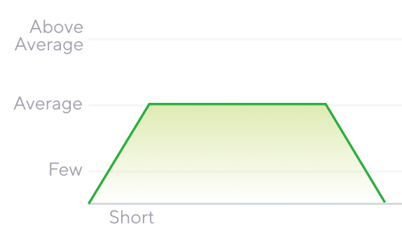

<!-- paginate: true -->

<ol class="table-content">
<li>導入</li>
<li>プロフィール・所属会社紹介</li>
<li>各環境・用語・計測ツール紹介</li>
<li class="active-text">負荷シナリオ１ - アベレージロードテスト</li>
<li>負荷シナリオ２ - スパイクテスト</li>
<li>総評と選択指針</li>
<li>環境を向上させるTips３選</li>
<li>まとめ</li>
</ol>

---

## 負荷試験シナリオ１ - アベレージロードテスト

  

  

    
ℹ️概要 ユーザーが記事を投稿する 投稿した記事を複数のユーザーが閲覧しに来る

    
🎯目的　多数のユーザーによる同時アクセス時の レスポンス性能 と 安定性 を評価する

  

---

<h3 class="test-icon">🧪試験概要</h3>

- **ユーザー行動**: 記事投稿 **1回**につき、記事閲覧が**10回**発生する
- **負荷増加**: 開始**60秒**で最大**80ユーザー/秒**まで増加させる
- **維持時間**: 最大負荷で**3分間**維持する 4分間でおおよそ**6500回**のリクエストが発生

<h3 class="check-icon"> 合格基準 (SLO)</h3>

- **記事投稿** (P90): **3秒**以内
- **記事閲覧** (P90): **1秒**以内
- **エラーレート**: **0.1%** 未満

---

## アプリ概要

 から
`api/read-weight` にPOST・GETリクエスト

計：９テーブルに書き込み 　　＆読み取る

1. usersd
2. posts
3. categories
4. tags
5. comments

6. post_views
7. likes
8. post_tags
9. post_categories

---

<h1> 📢 計測結果発表</h1>

---

どの環境もエラーは無し！ 
素晴らしい！
👏

---

<h2>🖥️ リソース使用量比較</h2>

CPU使用率とメモリ使用量の比較

| 環境 | 平均CPU使用率 | 平均メモリ使用量 |
| --- | --- | --- | 
| Apache+PHP | 35.77% | 360.08MiB |
| Nginx+PHP | 34.32% |  88.75MiB |
| Swoole | 32.03% | 962.9MiB |
| FrankenPHP |  20.47% | 288.4MiB |

---

<h2>▶️ PHP実行環境比較結果</h2>

レスポンス時間とスループットの比較

| 環境 | P95レスポンス | P90レスポンス | スループット |
| --- | --- | --- | --- |
| Apache+PHP | 36.91ms | 27.99ms | 28.49 RPS |
| Nginx+PHP | 33.77ms | 25.54ms | 28.06 RPS |
| Swoole | 27.15ms | 20.51ms | 28.58 RPS |
| FrankenPHP | 25.82ms | 19.51ms | 28.65 RPS |

---

<h2>➡️ レスポンス時間詳細比較</h2>

各処理別のレスポンス時間（P90）

| 環境 | POST処理（記事作成） | GET処理（記事取得） |
| --- | --- | --- |
| Apache+PHP | 49.61ms | 22.45ms |
| Nginx+PHP | 50.53ms | 20.69ms |
| Swoole | 45.64ms | 16.38ms |
| FrankenPHP | 45.86ms | 15.48ms |

---
<h2> 📢 計測結果総評</h2>

### リソース効率

<ul class="normal-text">
<li> 全環境でエラー発生なし（100%安定性） </li>
<li> CPU効率: FrankenPHP > Swoole > 従来構成 </li>
<li> メモリ効率: Nginx+PHP > FrankenPHP > Apache > Swoole </li>
</ul>

**補足**
<ul class="normal-text">
<li> Nginxはサーバーとphp-fpmでメモリが分散</li>
<li> Swooleはメモリにプロセスを常駐させるため、他と比べて消費率高 </li>
</ul>

---

### レスポンスパフォーマンス面

<ul class="middle-text">
<li> FrankenPHP・Swooleが総合的に最優秀 （レスポンス・CPU効率）  Apache, Nginxと比較で ⇧30-40%の性能向上を実現 </li>
</ul>

---

とはいえ…

| 環境 | P95レスポンス | P90レスポンス | スループット |
| --- | --- | --- | --- |
| Apache+PHP | 36.91ms | 27.99ms | 28.49 RPS |
| **FrankenPHP** | **25.82ms** | **19.51ms** | **28.65 RPS** |
| 差 | **-11.09ms** | **-8.48ms** | **+0.16 RPS** |

ここまで見て、意外と大差が付かなかったようにも 見えたのではないでしょうか

---

ここで影の立役者の登場
# OPcache

---

## Apache+mod_php OPcacheの有無で比較

同じ環境でもこれだけの違いが出ます

| 項目 | OPmcache無し | OPcache有り |
| --- | --- | --- | 
| **平均使用CPU** | 290% |48%（83%削減）|
| **平均使用メモリ** | 2.175 GiB |462.1 **MB**（79%削減）|

（CPUコア４つのため、100%越え）

---

## Apache+mod_php OPcacheの有無で比較

| 項目 | OPmcache無し | OPcache有り |
| --- | --- | --- | 
| **平均レスポンス** | 90.31ms |18.46ms（80%改善）|
| **P90レスポンス** | 119.35ms |27.99ms（77%改善）| 
| **P95レスポンス** | 130.59ms |36.91ms（72%改善）| 

